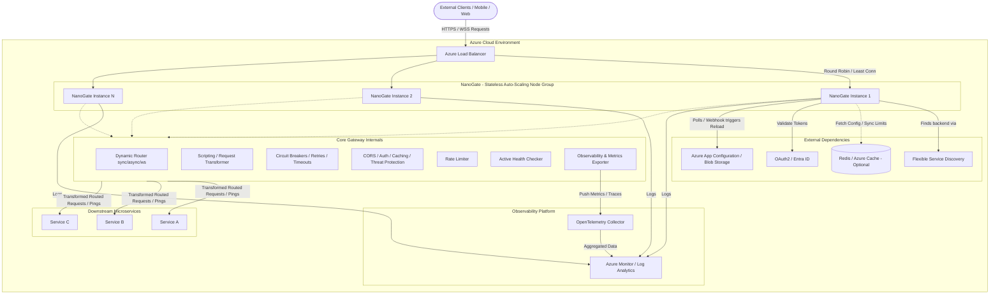

# NanoGate - Lightweight Scalable API Gateway Architecture

*Note: This solution is strictly an **API Gateway**, focused on decoupling clients from backends, API routing, and handling cross-cutting concerns. It is not a traditional Application Gateway, which usually focuses on general web traffic, WAF, and global load balancing.*

Below is the high-level architecture diagram for the **NanoGate** API Gateway, designed for deployment on Azure with a focus on horizontal scalability and deep observability.

## Architecture Breakdown

1. **Public DNS Definition (Client -> NanoGate):**
   This is handled outside the gateway. A public DNS `A` record (e.g., `api.yourcompany.com`) is pointed to the public IP address of the front-facing Azure Load Balancer. The gateway itself is not involved in this step.

2. **Entry Point (Azure Load Balancer):** 
   Acts as the primary ingress point, handling TLS termination and distributing incoming traffic across the available NanoGate instances.

3. **API Gateway Cluster (Horizontal Scaling):**
   The core of the project. These are stateless Spring Boot (or native) instances. As traffic spikes, Azure Virtual Machine Scale Sets (VMSS) or Azure Kubernetes Service (AKS) HPA (Horizontal Pod Autoscaler) spins up new instances. 

4. **Core Gateway Internals (The Decoupling Layer):**
   Implemented natively within this project to effectively decouple front-end clients from the backend:
   * **Dynamic Router:** Matches paths and headers to route traffic to the correct downstream service. It supports both **synchronous** blocking calls, **asynchronous** non-blocking flows, and natively proxies **WebSocket (ws/wss)** connections.
   * **API Versioning:** Routes requests to different downstream backends based on version indicators in the URL (`/api/v1/...`) or HTTP headers (`Accept-Version: v2`).
   * **Resiliency Engine:** A critical component for fault tolerance, implementing **Circuit Breakers**, **Timeouts**, and **Automatic Retries** to prevent cascading backend failures from crashing the gateway.
   * **Active Health Checker:** Continuously pings downstream services (e.g., via a `/health` endpoint) to ensure traffic is only routed to healthy instances.
   * **Scripting / Request Transformer:** A highly flexible, handy scripting engine (e.g., using GraalVM JavaScript or a custom DSL) allows administrators to dynamically rewrite URLs, modify payloads, and transform requests/responses on the fly before they hit the backend.
   * **Cross-Cutting Concerns & Security:** Centralized handling of essential API features including Cross-Origin Resource Sharing (CORS) support, authentication, response caching, and **Lightweight Threat Protection** (e.g., payload size limits, IP allowlisting).
   * **Rate Limiter:** Protects downstream services. By default, uses local memory for fast, basic limits (free). Can be configured to use Redis for distributed, exact limits.
   * **Metrics:** Captures exact instance-level throughput, latency, and memory usage.

5. **External Dependencies & Service Discovery:**
   * **Flexible Service Discovery (NanoGate -> Backend):** The gateway must be able to locate downstream microservices using a flexible, pluggable strategy. The routing configuration will define both the target service *and* the discovery method.
     * **Method 1: DNS-Based (Default):** The gateway simply routes to a stable internal DNS name (e.g., `http://user-service`). This is the standard for Kubernetes environments.
     * **Method 2: Service Registry:** The gateway integrates with a client library to query a dedicated service registry (like HashiCorp Consul or Azure Service Registry) to get a list of healthy backend instances. This is ideal for hybrid-cloud or non-Kubernetes environments.
   * **Dynamic Routing Configuration (Zero-Downtime Updates):** The gateway reads routing configurations from an external, centralized property store like **Azure App Configuration**. It reloads these rules dynamically without restarting.
   * **Redis (Optional):** Used for distributed rate-limiting counters and caching.
   * **Entra ID (Azure AD) / OAuth2:** Delegates token validation to standard Identity Providers.

6. **Observability Platform:**
   Every gateway instance pushes granular metrics via OpenTelemetry. Azure Monitor aggregates these logs and metrics to give you a single pane of glass into the health of *every specific instance* and the cluster as a whole.

7. **Downstream Microservices:**
   The actual business logic applications that the gateway is protecting and routing to.